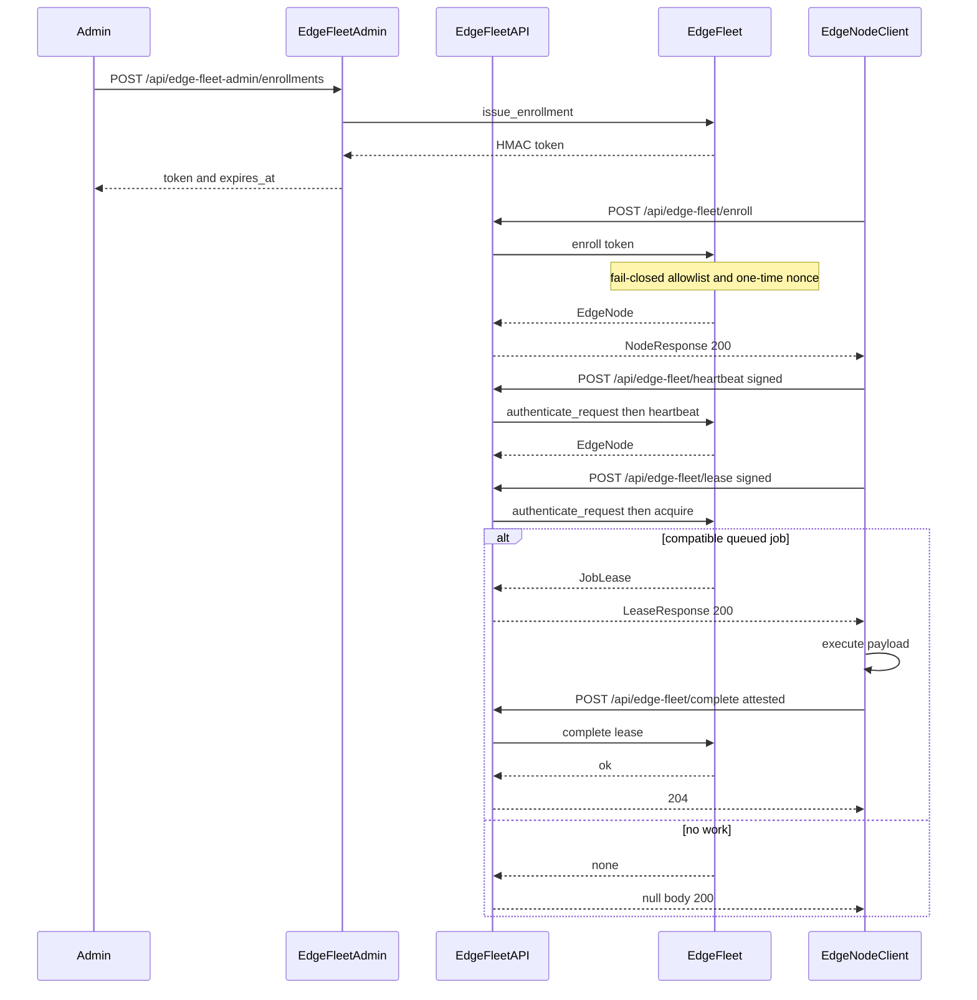
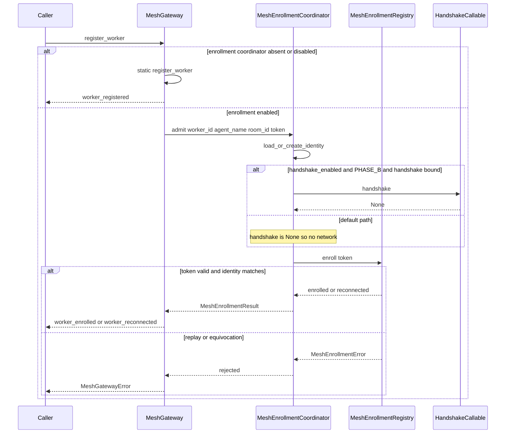
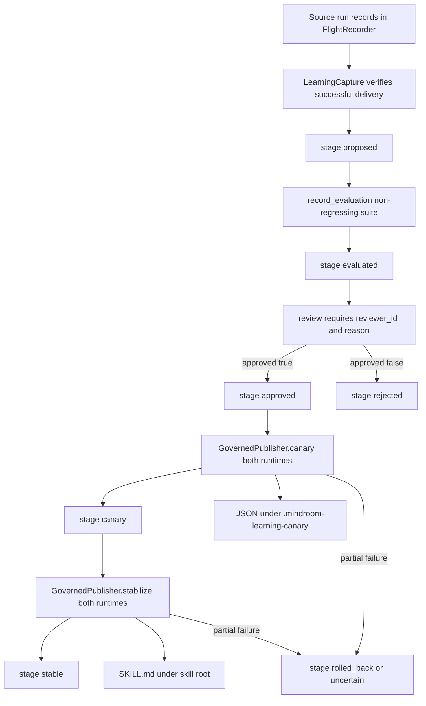
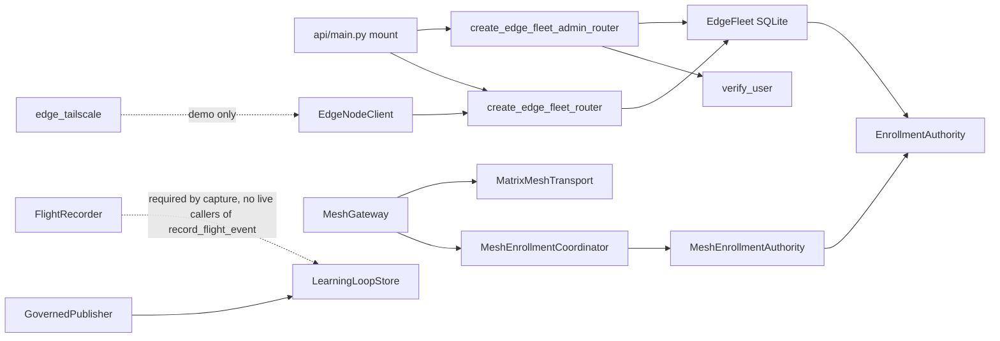

# Architecture — Edge Fleet, Mesh, and Learning Loop

This is a **partial** architectural model of the three activation surfaces.
It is synthesized from the listed source files and the developer scan.
Items marked **FACT** were read in source.
Items marked **HYPOTHESIS** are inferences not proven by a live process run.

## Architecture Analysis

### System Overview

MindRoom remains a modular monolith: one Python package, one FastAPI app, one process.
The three surfaces are libraries inside that process, not independently deployed services.
They share cryptographic style (HMAC enrollment, Ed25519 identities, canonical JSON) but they do not share a runtime composition root.

The chat turn pipeline (`TurnController` → `ResponseRunner` → `ai.py` / `teams.py`) does not own these surfaces.
**FACT:** `MeshGateway` is constructed in `src/mindroom/mesh/gateway.py` (`GatewayOnlyRuntime`) and `src/mindroom/mesh/demo.py` only.
**FACT:** the P10 types (`LearningLoopStore`, `GovernedPublisher`, `GovernedLearningRuntime`) are not imported by the orchestrator or bot modules.

### Architectural Style

**FACT:** in-process modular monolith with opt-in FastAPI routers and default-OFF feature flags.
Persistence is per-concern SQLite (WAL, `synchronous=FULL`), not a shared schema.
Mesh transport is an abstract `MeshTransport` with a Matrix-shaped adapter that defaults to an in-memory queue unless a `nio` client is injected.

This is not a mesh of MindRoom instances.
This is not a multi-tenant control plane.
Hosted SaaS (`saas-platform/`) is outside this scan.

### Bounded Contexts

| Context | Owns | Does not own |
|---------|------|--------------|
| Edge Fleet | Node identity, enrollment tokens, job queue, leases, result attestation, revocation tombstones | Mesh worker rooms, P10 proposals, Agno memory |
| Agent Mesh | Worker registration, outbox routing, reconnect cursors, optional enrollment coordinator | Edge job queue, dashboard auth |
| Governed Learning (P10) | Proposals, evaluation evidence, review, canary/stable receipts | Agno `Agent.learning`, chat turns |
| Dashboard Auth | Cookie/bearer/trusted-upstream identity for admin routes | Node Ed25519 attestation, `permissions` claims |
| Agno Learning | Per-agent preference memory when `learning:` is true | P10 SKILL.md promotion |

Ambiguous ownership is a design smell here: mesh enrollment subclasses the fleet `EnrollmentAuthority`, so claim format is shared, but the two inventories (`edge_node` vs `mesh_worker`) stay separate.

## Interaction Diagrams

### Enroll → lease → complete

Text fallback: an admin issues an HMAC enrollment token; the node consumes it at `POST /api/edge-fleet/enroll`; later signed POSTs heartbeat, lease, and complete against `/api/edge-fleet/*`; the store authenticates, allowlist-checks, leases the oldest compatible queued job, and accepts an Ed25519 result attestation.

### Mesh admit / handshake

Text fallback: `MeshGateway.register_worker` stays static unless an enrollment coordinator is present and `enabled`.
The coordinator may call `handshake()` only when `handshake_enabled` is true, `PHASE_B_HANDSHAKE_ENABLED` is true, and `handshake` is not `None`.
The default constructor sets `handshake=None` and `handshake_enabled=False`, so admit is local SQLite only.

### Learning propose → canary → stable

Text fallback: a candidate is captured only when the Flight Recorder shows a successful source run; evaluation must pass without score regression; review needs an attributable reviewer and reason; canary publishes JSON for both `openclaw` and `hermes` or rolls back; stabilize writes the native artifact (skill `SKILL.md` or memory upsert) or compensates back to canary.

## Component Relationships

## Data Flow

1. **Admin issue:** `POST /api/edge-fleet-admin/enrollments` → `EdgeFleet.issue_enrollment` → HMAC token (no-store).
2. **Node enroll:** `POST /api/edge-fleet/enroll` → verify claim → allowlist → consume nonce → insert `edge_node`.
3. **Node work:** signed POST `/heartbeat`, `/lease`, `/complete` → `authenticate_request` (clock skew 5 minutes, nonce once) → mutate `edge_job`.
4. **Revoke:** `DELETE /api/edge-fleet-admin/nodes/{node_id}` → `_require_revoke_permission` → `revoke_node` (tombstone + requeue leases + audit row).
5. **Mesh admit:** optional coordinator persist `mesh_worker` and optionally call `handshake()`.
6. **Learning:** Flight Recorder rows → `learning_proposal` → canary files → stable `SKILL.md` or memory action.

Durable paths (FACT):

- Fleet: `MINDROOM_EDGE_FLEET_PATH` or `{storage_root}/edge_fleet.db`.
- Mesh registry: caller-supplied SQLite path.
- Learning: `{tracking_dir}/learning_loop.db`.
- Flight Recorder: `{tracking_dir}/flight_recorder.db`.
- Canary: `{root}/.mindroom-learning-canary/{sha256(proposal_id)}.json`.
- Stable skill: `{skill_root}/{skill_id}/SKILL.md`.

## Key Design Decisions and Trade-offs

### 1. Fail-closed allowlist (`None` denies every enroll)

**Decision:** `EdgeFleet.enroll` rejects when `_node_allowlist is None` or the `node_id` is absent from the set.
**Alternative considered:** treat `None` as unrestricted (the property docstring still says "or None when not restricted").
**Trade-off:** an operator who sets the enable flag and key but forgets the allowlist env gets a mounted API that cannot admit anyone.
That is safer than an accidental open enroll, and it matches the intent's local-only containment.
**Consequence:** activation hygiene must document the allowlist as a required companion of the enable flag.

### 2. Router `node_allowlist` is accepted and unused

**Decision (observed):** `create_edge_fleet_router(..., node_allowlist=...)` takes the set and never reads it.
The store remains the only enforcer.
**Alternative considered:** enforce the allowlist again at the HTTP boundary.
**Trade-off:** one source of truth in the store; the router parameter is dead API surface and invites a false sense of a second check.
**HYPOTHESIS:** the parameter was left for a planned HTTP-layer check that was never wired.

### 3. Revoke permission lives on `user["permissions"]`, not in `verify_user`

**Decision:** `_require_revoke_permission` grants only when `admin.nodes.revoke` is in the authenticated dict.
**FACT:** production `verify_user` returns `{user_id, email}` (standalone `{user_id: "standalone", email: None}`; trusted-upstream may add `matrix_user_id` and `auth_source`) and never a `permissions` field.
**Alternative considered:** a dedicated admin role, an env allowlist of revokers, or treating any authenticated dashboard user as a revoker.
**Trade-off:** tests can inject a permissions-bearing dependency and prove the store; production DELETE is always 403.
That is fail-closed and also means SM1's "revocation must work" is not met by the mounted path.
Store `revoke_node` itself is complete.

### 4. Tailscale check is advisory and unhooked

**Decision (observed):** `check_tailscale_connectivity` runs `tailscale status --json` and returns a dataclass.
`require_tailscale` logs on failure and still returns the result; it does not raise.
**Alternative considered:** raise (as the docstring claims) and call it from every fleet router handler.
**Trade-off:** the helper is easy to unit-test and does not break loopback CI, but the standing directive in the module docstring is not enforced.
Revocation plus a real Tailscale preflight are sign-off prerequisites for this intent.

### 5. Mesh handshake is a nullary callable, default off

**Decision:** `handshake: Callable[[], None] | None = None` and `handshake_enabled=False`.
`PHASE_B_HANDSHAKE_ENABLED = True` only *permits* a call.
**Alternative considered:** a typed handshake protocol (URL, token, response) or constructing the gateway from the orchestrator.
**Trade-off:** no accidental network; also no implementable contract for SM3 beyond "call this thunk".
**FACT:** `MINDROOM_MESH_ENROLLMENT` is read only by `enrollment_flag_enabled`, which has no production callers.

### 6. Default mesh transport is in-memory

**Decision:** `MatrixMeshTransport.client` defaults to `None` and then appends to `_delivered_messages`.
**Alternative considered:** require a live `nio.AsyncClient`.
**Trade-off:** tests and demos do not need a homeserver; live Matrix delivery never happens unless an operator injects a client.
No API or orchestrator performs that injection.

### 7. Two different "learning" systems

**Decision (observed):** Agno `learning:` on agent config is independent of P10 `LearningLoopStore`.
**Trade-off:** flipping `openclaw` to `learning: true` (SM5) does not implement SM4.
Wiring P10 into live turns requires a candidate producer plus `record_flight_event` (currently unused).

### 8. Canary JSON versus stable SKILL.md

**Decision:** canary is a non-executable receipt-bound JSON namespace; stable writes a native skill file or memory action.
**Alternative considered:** canary in the real skill root with a suffix, or a single publisher.
**Trade-off:** canary cannot be executed by accident; stabilize must then copy into the real seam and compensate both runtimes on failure.

## Activation and Failure Behaviour

| Gate | Closed behaviour | Open behaviour |
|------|------------------|----------------|
| `MINDROOM_EDGE_FLEET_ENABLED` false or key invalid | `_edge_fleet_from_runtime_paths` returns `None`; no routes; `/api/health` reports `edge_fleet.enabled=false` | Routers mount; fleet DB opened on startup |
| Allowlist unset or identity missing | `enroll` raises `EdgeFleetError`; HTTP 401 | Identity may persist |
| Node revoked | heartbeat/lease/complete/re-enroll fail | Tombstone remains until an out-of-band clear |
| Admin revoke without permission | HTTP 403 + `admin.node_revoke_denied` | Store revoke is never reached |
| Mesh coordinator absent | static `register_worker` | admit/re-admit via registry |
| Mesh handshake defaults | no network | `handshake()` once per `admit` if all three gates are on |
| Learning capture without flight records | `LearningLoopError` | proposal inserted at `proposed` |

## Improvement Opportunities

These are observations for later Inception stages, not new requirements.

- Wire or delete `create_edge_fleet_router.node_allowlist`.
- Give `verify_user` a real permission source, or change `_require_revoke_permission` to a mechanism the production identity actually carries.
- Make `require_tailscale` raise (or stop claiming that it does) and call it from fleet operations.
- Either read `MINDROOM_MESH_ENROLLMENT` at the composition root or remove the env flag.
- Emit Flight Recorder events from live turns if SM4 is to be more than the demo script.
- Reconcile the three documents that disagree about P9/P10/Phase B approval.

## Assumptions

- **HYPOTHESIS:** later units will treat the FastAPI app as the only production composition root for the fleet, and `GatewayOnlyRuntime` as a demo/test root for the mesh.
- **HYPOTHESIS:** P10 will stay a library invoked by an explicit producer, not a silent side effect of every agent turn.
