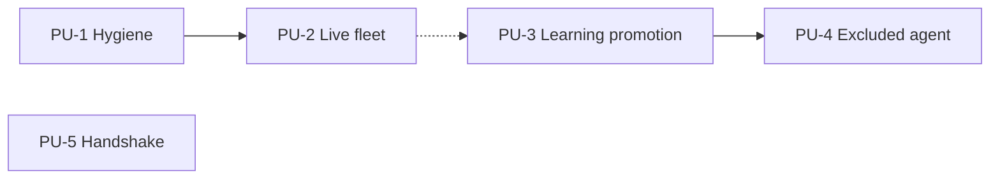

# Intent Backlog — Edge Fleet / Mesh / Learning Activation

First-cut proto-units for this initiative.
Units Generation will refine names, boundaries, and the dependency graph.
This cut exists so four unequally reachable outcomes are not treated as four equal work items. [Q11]

## Sources

- `scope-document.md` — in/out boundary and revised success metrics
- `intent-statement.md` in `intent-capture/` — original SM1–SM5
- `feasibility-assessment.md` in `feasibility/` — reachability of each outcome
- `constraint-register.md` in `feasibility/` — non-negotiable boundaries
- `scope-definition-questions.md` — Q1–Q11

## Proto-Units

| ID | Proto-unit | Priority | Covers | Depends on |
|----|------------|----------|--------|------------|
| PU-1 | Activation hygiene | Must | Revocation actually works; Tailscale check is enforced; allowlist makes enrollment possible; leftover demo key is removed | None |
| PU-2 | Live fleet increment | Must | A real worker enrolls, takes a job, and finishes it on the local install; contradictory activation-status documents are corrected; rollback procedure is written; sign-off is requested | PU-1 |
| PU-3 | Live learning-loop promotion | Must | A skill originating from a live agent run is promoted through automated canary and human-approved stable install | PU-2 recommended, not hard |
| PU-4 | Excluded-agent participation | Should | The one agent currently excluded from learning is turned on, after the self-referential path is examined | PU-3 |
| PU-5 | OpenClaw enrollment handshake | Should | A real gateway completes the handshake if Reverse Engineering finds a usable surface; unread mesh switch is wired or removed; live mesh wiring is sized and included only if that inspection says it must be | Reverse Engineering; may be deferred |

PU-2 is the first increment that counts. [Q2]
PU-1 is a prerequisite of the security sign-off, not a substitute for PU-2. [Q7]

There is no proto-unit for "the AI-DLC agent team queues and leases work at runtime."
That outcome was dropped. [Q3]

## Why This Slice

Q11 chose hygiene first, then one proto-unit per remaining in-scope outcome.
The remaining outcomes after the drop are the live fleet increment, live promotion, the excluded agent, and the handshake.

Status-document correction sits in PU-2 because it is about the activation gate that PU-2 requests.
The unread mesh switch sits in PU-5 because it is mesh configuration, not fleet containment.

PU-3 does not hard-depend on PU-2.
A live promotion path can be wired without a fleet worker.
Risk-first sequencing still prefers proving the fleet increment first, because that is the stated minimum that closes the documented-but-inert gap. [Q2] [Q6]

## Prioritization

MoSCoW is the release rule.
WSJF is the order inside the Must and Should bands.
Scores are relative 1–8, not estimates.

Cost of Delay = user-business value + time criticality + risk reduction.

| ID | Value | Time criticality | Risk reduction | Cost of Delay | Size | WSJF | Band |
|----|-------|------------------|----------------|---------------|------|------|------|
| PU-1 | 3 | 8 | 8 | 19 | 3 | 6.3 | Must — first |
| PU-2 | 8 | 5 | 5 | 18 | 5 | 3.6 | Must — second |
| PU-3 | 5 | 2 | 3 | 10 | 5 | 2.0 | Must — third |
| PU-4 | 2 | 1 | 2 | 5 | 2 | 2.5 | Should — after PU-3 |
| PU-5 | 3 | 1 | 2 | 6 | 8 | 0.8 | Should — contingent |

PU-1 ranks first because the two Critical defects make sign-off unreasonable today.
PU-5 ranks last among in-scope work because its size is unknown and its surface is uninspected.
If Reverse Engineering finds no usable handshake surface, PU-5 is deferred rather than forced. [Q4]

RICE is a poor fit here: reach is one operator on one local install, so the Reach term collapses every score.
WSJF is the operative ranking.

## Dependency Sketch

Text fallback: PU-1 unblocks PU-2.
PU-2 is preferred before PU-3 but is not a hard blocker.
PU-3 unblocks PU-4.
PU-5 has no hard predecessor inside this backlog; it waits on Reverse Engineering and may leave the release.

## Delivery Notes

These proto-units are sized for later Bolt planning, not for a calendar.
There is no deadline. [constraint-register]
Correctness is preferred over speed.

The first Bolt that can earn the activation sign-off is PU-1 plus the live path in PU-2.
Shipping PU-1 alone does not yet close the documented-but-inert gap. [Q2]

If PU-5's mesh-wiring job is as large as the handshake itself, that finding belongs in Reverse Engineering and may move PU-5 to Won't Have this time without reopening PU-1 through PU-4. [Q8]

## Assumptions & Open Questions

- **Assumption** — PU-1 through PU-4 can be delivered against the current local install without a hosted-platform change.
  Follows the constraint register; not re-tested here.
- **Open question** — PU-5 effort and even presence stay unknown until the local OpenClaw install is inspected.
- **Open question** — Units Generation may split PU-1 if revocation and the Tailscale check prove to be separate ownership boundaries.
  This backlog does not pre-split them, because both are prerequisites of the same sign-off. [Q7]
