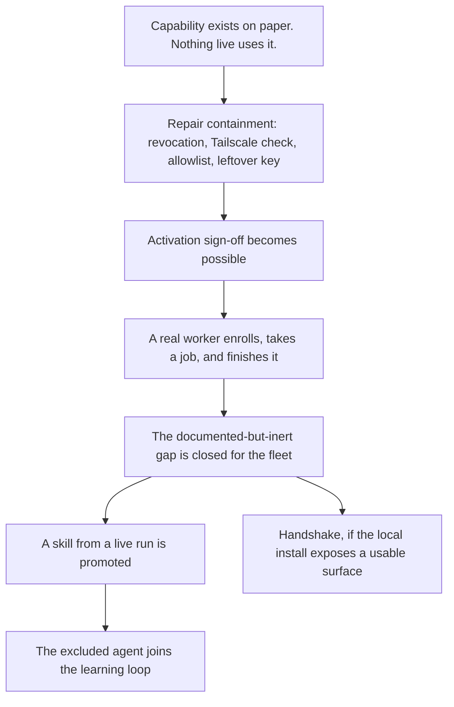

# Scope Document — Edge Fleet / Mesh / Learning Activation

## Glossary

| Term | Meaning |
|------|---------|
| Edge Fleet | The part of MindRoom that lets separate worker processes enroll, take on queued jobs, and report results back |
| Worker enrollment | The one-time handshake in which a new worker proves its identity and is admitted to the fleet |
| Lease | A claim a worker takes on one queued job, so two workers cannot do the same work |
| Revocation | The administrative act of ejecting an enrolled worker so it can no longer take work |
| Mesh | A separate coordination layer for routing work between MindRoom instances |
| Handshake | The enrollment conversation between a live OpenClaw gateway and the mesh extension point that is inert today |
| Learning loop | The path that captures a skill from a real agent run, reviews it, and installs it |
| Canary promotion | Installing a learned skill to a side location first, where it can be observed |
| Stable promotion | Installing a learned skill into the runtime's real skill directory |
| Tailnet | The private network created by Tailscale, reachable only by machines you have enrolled in it |
| Hygiene | Repairs that make activation containable before it is signed off |

## Sources

- `intent-statement.md` in `intent-capture/` — original four-outcome milestone and success metrics SM1–SM5
- `feasibility-assessment.md` in `feasibility/` — which outcomes are reachable, and which are not
- `constraint-register.md` in `feasibility/` — local-only target, Tailscale-only reachability, existing authentication, no deadline, flag-plus-cleanup rollback
- `scope-definition-questions.md` — confirmed answers Q1–Q11

## What This Document Settles

The intent statement treated all four outcomes as one activation milestone that could not ship in pieces. [Q1]
The feasibility assessment found those outcomes are not equally reachable.
This document supersedes the single-milestone stance: the four remain one initiative, and they may ship as sequenced increments. [Q1]

The problem being solved is unchanged: capability exists as engineering deliverables, and nothing live uses it.

## In Scope

### Must Have

- Repair the two Critical fleet defects before any activation sign-off: administrative revocation must actually work, and every fleet operation must verify tailnet connectivity. [Q6] [Q7]
- Make enrollment possible by configuring the fail-closed allowlist, and remove the leftover demo administrative key. [Q9] [Q11]
- A real worker enrolls, takes a job, and finishes it on the local install. That is the first increment that counts as closing the documented-but-inert gap. [Q2]
- The learning loop promotes a skill that originated from a live agent run, through automated canary and human-approved stable install. [Q5]
- Establish the real Edge Fleet activation-gate status as an output of this work, and correct the two documents that currently disagree about whether approval already exists. [Q9]
- A written rollback procedure covering enrolled workers, leases, and persisted records, in addition to turning the capability off.

### Should Have

- The OpenClaw enrollment handshake, if Reverse Engineering finds a usable surface on the local install; otherwise defer. [Q4]
- Enabling learning on the one currently excluded agent, after the self-referential path (that agent is named for the runtime the promotion pipeline installs into) has been examined. [Q5]
- Either wire or remove the mesh enrollment switch and configuration that nothing currently reads. [Q9]
- Resolve how much live mesh wiring the handshake needs, after Reverse Engineering sizes that gap. [Q8]

### Could Have

- An inspect-and-record-only write-up of the local OpenClaw and Hermes surfaces, even if the handshake itself is deferred. [Q4]

## Out of Scope

These are Won't Have for this initiative.

From the constraint register, unchanged:

- The hosted multi-tenant platform
- Any public network exposure
- A new authentication or worker-identity scheme
- A third worker runtime beyond the two the fleet already admits

Added by this stage: [Q3] [Q10]

- "The AI-DLC agent team can queue and lease work at runtime" — dropped.
  Those agents are development-tooling definitions, not MindRoom runtime actors.
- Making development-tooling agents into chat-runtime agents
- General-purpose mesh routing between MindRoom instances.
  Only the enrollment handshake remains, and only as a Should Have.

## Success Metrics (revised)

The intent statement's metrics are restated to match this boundary.

| # | Outcome | Priority | Status vs intent statement |
|---|---------|----------|----------------------------|
| SM1 | A real worker of each admitted runtime enrolls, takes a job, and finishes it on the local install, after the security sign-off | Must | Kept; first increment that counts [Q2] |
| SM2 | The AI-DLC agent team queues and leases work at runtime | Won't | Dropped [Q3] |
| SM3 | A real OpenClaw gateway completes the enrollment handshake | Should | Kept if inspection finds a usable surface [Q4] |
| SM4 | The learning loop promotes a skill from a live agent run through canary, then human-approved stable install | Must | Kept [Q5] |
| SM5 | The currently excluded agent participates in the learning loop | Should | Kept after the self-referential path is examined [Q5] |

SM1 is not signed off until revocation works and the Tailscale check is real. [Q7]

## Sequencing

There is no deadline. [constraint-register]
Sequence is risk-first. [Q6]

1. Activation hygiene — revocation, Tailscale check, allowlist, demo-key removal.
2. Sign-off becomes possible.
3. The live-worker increment (SM1).
4. Remaining Must and Should outcomes as separate increments: learning-loop promotion, then the excluded agent, and the handshake if inspection supports it.

The four outcomes do not proceed as independent parallel tracks. [Q6]
Hygiene is a prerequisite of sign-off, not a substitute for the live-worker increment. [Q2] [Q7]

## Value Stream

The customer is internal: the person operating the local install.
Value is a live path where today there is only documentation.

Text fallback: documented-but-inert capability is repaired until containment works; sign-off follows; a live worker is the first increment that counts; learning-loop promotion and a possible handshake come after that; enabling the excluded agent comes after promotion is real.

## Constraints Carried Forward

The constraint register still binds.
This document does not reopen local-only targeting, Tailscale-only reachability, reuse of the existing enrollment authentication, the absence of a deadline, or rollback as a flag flip plus written cleanup.

The high tolerance for disruption applies to the local development runtime, not to the activation itself.
Sign-off and rollback discipline remain in force.

## Assumptions & Open Questions

- **Assumption** — the locally installed OpenClaw and Hermes expose a surface stable enough to inspect and, if warranted, to handshake against.
  Inherited from the feasibility assessment; still unvalidated until Reverse Engineering.
- **Open question** — how large the live mesh-wiring job is if the handshake stays in.
  Deliberately deferred to Reverse Engineering. [Q8]
- **Open question** — whether enabling the excluded agent creates a self-referential learning path that should stay off.
  To be examined when that Should Have is designed. [Q5]
