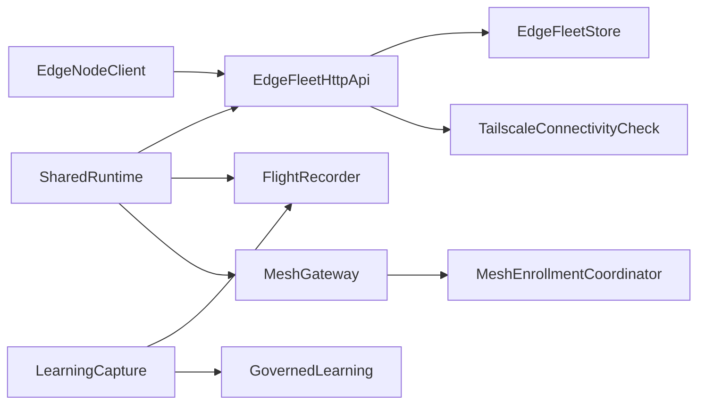

# Components — Edge Fleet / Mesh / Learning Activation

No new bounded building block is added. [Q1]
Existing components take on the approved behaviour.

```yaml
components:
  - name: EdgeFleetStore
    summary: Owns worker identity, jobs, leases, revoke tombstones, and fail-closed allowlist
    behaviour: >
      Enrolls a worker only when the identity is on the configured allowlist.
      Revokes by tombstone in one transaction and requeues that worker's leases.
      Does not interpret dashboard permissions or tailnet state.
    responsibilities:
      - Persist nodes, jobs, leases, and audit rows
      - Enforce allowlist and one-time enrollment tokens
      - Apply revoke tombstones
    depends_on: []
    dependents:
      - component: EdgeFleetHttpApi
        interaction: HTTP layer calls store after its own checks
    external_dependencies:
      - name: SQLite
        kind: database
        purpose: Fleet nodes, jobs, leases, audit
    entities:
      - name: EdgeNode
        identifier: node_id
        attributes: [node_id, runtime, revoked_at]
      - name: JobLease
        identifier: lease_id
        attributes: [lease_id, job_id, node_id, state]
        references:
          - entity: EdgeNode
            owned_by: EdgeFleetStore
            relationship: each lease belongs to one node

  - name: EdgeFleetHttpApi
    summary: Node and admin HTTP boundary for the fleet
    behaviour: >
      Confirms tailnet connectivity before enroll, heartbeat, lease, and complete, and refuses when the check fails.
      Lets the signed-in local operator revoke without a separate permission claim.
      Removes the unused allowlist parameter; store enforcement remains the source of truth.
    responsibilities:
      - Expose enroll, heartbeat, lease, complete
      - Expose admin revoke for the signed-in operator
      - Fail closed on missing tailnet
    depends_on:
      - component: EdgeFleetStore
        interaction: persist and mutate fleet state
        style: sync
      - component: TailscaleConnectivityCheck
        interaction: confirm tailnet before each fleet operation
        style: sync
    dependents:
      - component: EdgeNodeClient
        interaction: worker calls node routes
      - component: SharedRuntime
        interaction: mounts the routers when the fleet flag and key are valid
    entities: []

  - name: TailscaleConnectivityCheck
    summary: Probes tailnet connectivity
    behaviour: >
      Reports whether the machine is on the tailnet.
      A failed or absent result is treated as failure by the HTTP API, not as a log-only event.
    responsibilities:
      - Answer connected or not
    depends_on: []
    dependents:
      - component: EdgeFleetHttpApi
        interaction: called before fleet operations
    external_dependencies:
      - name: Tailscale CLI
        kind: other
        purpose: status probe
    entities: []

  - name: EdgeNodeClient
    summary: Worker-side client and documented start command
    behaviour: >
      Starts from a documented operator command against the local install.
      Enrolls, heartbeats, leases, and completes using existing attestation.
      Does not live inside the orchestrator process.
    responsibilities:
      - Worker identity file
      - Signed calls to EdgeFleetHttpApi
      - Operator start path for OpenClaw and Hermes runtimes
    depends_on:
      - component: EdgeFleetHttpApi
        interaction: enroll, heartbeat, lease, complete
        style: sync
    dependents: []
    entities: []

  - name: FlightRecorder
    summary: Durable evidence that a live agent reply succeeded
    behaviour: >
      A real caller on the visible-delivery path writes a record after a successful visible reply.
      Learning Capture will not propose a candidate without that record.
    responsibilities:
      - Persist successful visible-delivery evidence
    depends_on: []
    dependents:
      - component: LearningCapture
        interaction: require a record before proposing
      - component: SharedRuntime
        interaction: turn pipeline writes the record
    external_dependencies:
      - name: SQLite
        kind: database
        purpose: Flight records
    entities:
      - name: FlightRecord
        identifier: record_id
        attributes: [record_id, run_id, visible_delivery]

  - name: LearningCapture
    summary: Turns proven live runs into promotion candidates
    behaviour: >
      Reads FlightRecorder evidence after a visible reply and proposes a candidate.
      Does not accept a demo-script-only origin.
    responsibilities:
      - Gate propose on live evidence
    depends_on:
      - component: FlightRecorder
        interaction: require evidence
        style: sync
      - component: GovernedLearning
        interaction: write a proposal
        style: sync
    dependents: []
    entities: []

  - name: GovernedLearning
    summary: Proposal ledger, canary, and human-gated stable install
    behaviour: >
      Moves a proposal through proposed, evaluated, review, canary, and stable.
      Canary and stable must land in both OpenClaw and Hermes roots.
      Stable requires a named reviewer and reason.
    responsibilities:
      - Store proposals
      - Canary and stable publish
    depends_on: []
    dependents:
      - component: LearningCapture
        interaction: create proposals
    external_dependencies:
      - name: SQLite
        kind: database
        purpose: Proposal ledger
      - name: OpenClaw skill root
        kind: object-store
        purpose: Canary and stable install
      - name: Hermes skill root
        kind: object-store
        purpose: Canary and stable install
    entities:
      - name: LearningProposal
        identifier: proposal_id
        attributes: [proposal_id, stage, digest, reviewer_id]

  - name: MeshGateway
    summary: In-process mesh router and optional enrollment
    behaviour: >
      Stays inert unless SharedRuntime starts it with enrollment enabled.
      Handshake still requires a bound callable after local OpenClaw inspection.
    responsibilities:
      - Register workers
      - Optional enroll via coordinator
    depends_on:
      - component: MeshEnrollmentCoordinator
        interaction: admit workers when enrollment is enabled
        style: sync
    dependents:
      - component: SharedRuntime
        interaction: start when the mesh enrollment switch is on
    entities:
      - name: MeshWorker
        identifier: worker_id
        attributes: [worker_id, room_id]

  - name: MeshEnrollmentCoordinator
    summary: Identity, token check, and optional handshake callable
    behaviour: >
      Calls handshake only when enabled and a callable is bound.
      Default remains no network.
    responsibilities:
      - Admit or reject enrollment tokens
      - Invoke handshake if bound
    depends_on: []
    dependents:
      - component: MeshGateway
        interaction: admit path
    entities: []

  - name: SharedRuntime
    summary: Process composition root — mount, health, optional mesh start
    behaviour: >
      Mounts EdgeFleetHttpApi only when the fleet flag and enrollment key are valid.
      Starts MeshGateway when the existing mesh enrollment switch is on, if the handshake increment proceeds.
      Publishes activation status on health so documents can quote one source of truth.
      Writes FlightRecorder after a successful visible reply.
    responsibilities:
      - Feature-flagged mount
      - Health status payload
      - Visible-delivery hook into FlightRecorder
      - Optional mesh start
    depends_on:
      - component: EdgeFleetHttpApi
        interaction: mount routers
        style: sync
      - component: FlightRecorder
        interaction: record visible delivery
        style: sync
      - component: MeshGateway
        interaction: start when enrollment switch is on
        style: sync
    dependents: []
    external_dependencies: []
    entities: []
```

## Component Diagram



Text fallback: SharedRuntime mounts the fleet API, records visible deliveries, and may start the mesh.
The fleet API checks Tailscale then calls the store.
The worker client calls the fleet API.
Learning capture reads the flight record and writes a proposal.
The mesh gateway admits through the enrollment coordinator.

## Component Summary

| Component | Purpose | Depends On | Dependents | Entities Owned |
|-----------|---------|------------|------------|----------------|
| EdgeFleetStore | Fleet persistence and allowlist | — | EdgeFleetHttpApi | EdgeNode, JobLease |
| EdgeFleetHttpApi | Fleet HTTP + tailnet + operator revoke | EdgeFleetStore, TailscaleConnectivityCheck | EdgeNodeClient, SharedRuntime | — |
| TailscaleConnectivityCheck | Tailnet probe | — | EdgeFleetHttpApi | — |
| EdgeNodeClient | Operator-started worker client | EdgeFleetHttpApi | — | — |
| FlightRecorder | Visible-delivery evidence | — | LearningCapture, SharedRuntime | FlightRecord |
| LearningCapture | Live-run to proposal | FlightRecorder, GovernedLearning | — | — |
| GovernedLearning | Canary and stable promotion | — | LearningCapture | LearningProposal |
| MeshGateway | Optional live mesh | MeshEnrollmentCoordinator | SharedRuntime | MeshWorker |
| MeshEnrollmentCoordinator | Admit + optional handshake | — | MeshGateway | — |
| SharedRuntime | Mount, health, hooks | EdgeFleetHttpApi, FlightRecorder, MeshGateway | — | — |

## Entity Ownership

| Entity | Owning Component | Identifier | Attributes | References |
|--------|------------------|------------|------------|------------|
| EdgeNode | EdgeFleetStore | node_id | node_id, runtime, revoked_at | — |
| JobLease | EdgeFleetStore | lease_id | lease_id, job_id, node_id, state | EdgeNode |
| FlightRecord | FlightRecorder | record_id | record_id, run_id, visible_delivery | — |
| LearningProposal | GovernedLearning | proposal_id | proposal_id, stage, digest, reviewer_id | — |
| MeshWorker | MeshGateway | worker_id | worker_id, room_id | — |

## External Dependencies

| Component | Dependency | Kind | Purpose |
|-----------|------------|------|---------|
| EdgeFleetStore | SQLite | database | Fleet state |
| TailscaleConnectivityCheck | Tailscale CLI | other | Status probe |
| FlightRecorder | SQLite | database | Flight records |
| GovernedLearning | SQLite | database | Proposals |
| GovernedLearning | OpenClaw skill root | object-store | Canary and stable |
| GovernedLearning | Hermes skill root | object-store | Canary and stable |

## Rationale

| Component | Why it stays separate |
|-----------|------------------------|
| EdgeFleetStore | Distinct data and invariants from HTTP |
| EdgeFleetHttpApi | Owns transport checks (tailnet, operator revoke) that the store must not know |
| TailscaleConnectivityCheck | Existing helper; remains a dependency, not a new product |
| EdgeNodeClient | Lives outside the server process; operator-started |
| FlightRecorder | Evidence ledger already exists; wiring it is cheaper than a new capture store |
| LearningCapture | Policy for “live run only”; does not own the ledger |
| GovernedLearning | Promotion state machine and dual-root install |
| MeshGateway | Optional; started only if handshake stays in |
| MeshEnrollmentCoordinator | Handshake binding is here, not in the gateway |
| SharedRuntime | Composition root only — no new domain |

## Alternatives Rejected

See `decisions.md`.
No UI components are introduced.
No AWS services are components; the target is the local install.

## Assumptions & Open Questions

- **Assumption** — the visible-delivery path in SharedRuntime is a single place that can call FlightRecorder.
- **Open question** — MeshGateway start is conditional on FR4 inspection.

## Review

**Verdict:** READY
**Reviewer:** aidlc-architecture-reviewer-agent
**Date:** 2026-08-16T18:15:01Z
**Iteration:** 1

### Findings

| # | Severity | Location | Finding | Recommendation |
|---|---|---|---|---|
| 1 | Major | `components.md` SharedRuntime / LearningCapture; ADR-005; `architecture.md` learning flow | FR3.1 is not an implementable call path. SharedRuntime writes `FlightRecorder` after a visible reply, then LearningCapture is supposed to propose — but LearningCapture has `dependents: []` and SharedRuntime does not `depends_on` LearningCapture. Inventory already names Learning Runtime as the ingest/review caller; it is omitted here. SharedRuntime is also specified as “composition root only” (API mount + health) while owning the visible-delivery hook; `architecture.md` places that path in the turn pipeline, not `api/main.py`. A developer must guess who calls `propose` and which existing module is SharedRuntime. | Add the missing edge (SharedRuntime or the existing Learning Runtime calls LearningCapture after the flight write). Split or name the turn-pipeline writer so it is not implied to live on the fleet mount. |
| 2 | Major | `components.md` EdgeFleetHttpApi responsibilities; FR2.1–FR2.4; `architecture.md` enroll → lease → complete | The increment that counts has no catalogue owner for issuing an enrollment token or enqueueing a job. EdgeFleetHttpApi lists enroll/heartbeat/lease/complete and admin revoke only. Traceability pins FR2.1–FR2.4 on EdgeNodeClient, which cannot create tokens or queue work. Brownfield already has admin issue-enrollment and the store job queue; this design never assigns them. | Give EdgeFleetHttpApi (or EdgeFleetStore) explicit responsibilities for operator issue-enrollment and enqueue-compatible-job, and retarget FR2 coverage so the live path is more than “start the client.” |
| 3 | Minor | `components.md` MeshGateway `entities.MeshWorker`; `component-inventory.md` ownership table | `MeshWorker` is owned by MeshGateway here. Inventory assigns `mesh_worker` rows to Mesh Enrollment Registry, which is not in the catalogue. | Keep ownership on the registry or record the merge so persistence is not relocated into the gateway. |
| 4 | Minor | `components.md` EdgeFleetStore `JobLease.references` | JobLease references EdgeNode with `owned_by: EdgeFleetStore`. Well-formedness allows `references` only for entities in other components. | Drop the same-component reference; keep `node_id` as an attribute. |
| 5 | Minor | `components.md` EdgeFleetStore entities vs responsibilities | Store “persist … jobs” and inventory `EdgeJob` have no entity. `JobLease.job_id` does not resolve to a declared entity. | Add EdgeJob under EdgeFleetStore or state that a job is not a distinct owned entity. |
| 6 | Minor | `traceability.json` FR1.7 → EdgeNodeClient; FR4.1 → MeshEnrollmentCoordinator | FR1.7 is leftover demo-key rotation in the repository, not worker-client behaviour. FR4.1 is a local-install inspection, not runtime admission. | Mark FR1.7 and FR4.1 `N/A` (procedure/inspection) or retarget FR1.7 to the demo/docs surface that holds the key. |

### Validation Tool Results

| Tool | Result | Interpretation |
|---|---|---|
| Stage-listed validation tools | None listed (sensors only: required-sections, upstream-coverage, traceability) | No reviewer CLI was specified; structural check run instead. |
| Catalogue well-formedness (unique names, symmetric depends_on/dependents, no self-deps, acyclic, entities owned once, refs resolve) | PASS except JobLease → EdgeNode same-component `references` | Confirms finding #4. Ten unique names; nine directed edges; no cycles; every `component:` / `owned_by` resolves. |
| Q1–Q7 vs catalogue / ADRs | PASS | No new component; revoke and Tailscale stay on EdgeFleetHttpApi; worker start on EdgeNodeClient; FlightRecorder + LearningCapture; mesh start and health on SharedRuntime. |
| New component / AWS slip-in | PASS | Names are inventory/section aliases (SharedRuntime, GovernedLearning). Externals are SQLite, Tailscale CLI, OpenClaw/Hermes skill roots only. |
| FR coverage in `traceability.json` | PASS (33/33 IDs) | Every requirements FR is declared. FR3.5, FR3.6, FR5.2, FR6.2 are N/A; FR4.3 Deferred. Targets exist except the N/A/Deferred notes. |

### Summary

Boundaries follow Q1–Q7 and stay inside the brownfield inventory, with a clean acyclic graph. The human gate should still weigh the two Majors: FR3.1 has no caller for LearningCapture and pins the write on a composition root that is not the turn pipeline, and FR2 never assigns token-issue or job enqueue.
